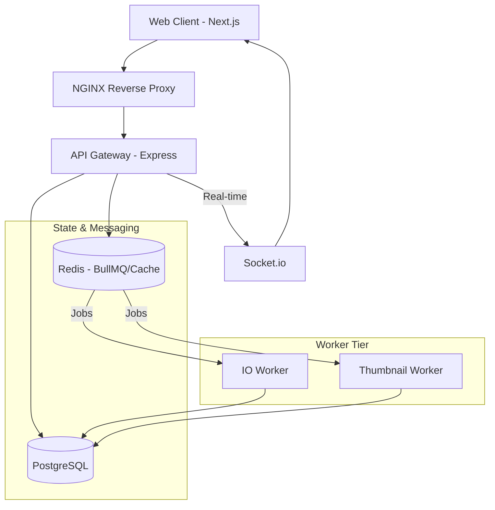

# Homelab System Design

Homelab is a high-performance, LAN-first personal cloud platform engineered with a focus on **distributed systems patterns**, **asynchronous processing**, and **security-first resource management**.

This document provides a deep dive into the architectural decisions, data flows, and engineering trade-offs that drive the platform.

---

## 1. High-Level Architecture

Homelab employs a **modular monolith** backend (Express.js) that orchestrates work across a distributed infrastructure. Heavy computational and I/O tasks are decoupled from the request-response cycle via a persistent task queue.

---

## 2. Core Pillars & Implementation

### A. Authentication & Session Management

Homelab implements a robust **JWT-based authentication** system with advanced security features:

- **Dual-Token Strategy:** Short-lived Access Tokens (JWT) + Long-lived Refresh Tokens (Database-backed).
- **Refresh Token Rotation:** Every refresh cycle issues a new token pair, invalidating the old refresh token.
- **Token Families & Reuse Detection:** All refresh tokens in a "session" belong to a family. If a revoked token is reused (indicating a potential breach), the entire family is immediately invalidated.
- **Race Condition Resilience:** A **30-second grace period** is implemented for rotated tokens to handle concurrent network requests without forcing a logout.
- **TFA/OTP:** Multi-factor authentication via email for sensitive operations (login, password reset).

### B. Storage Engine: Content-Addressable Storage (CAS)

Unlike naive storage systems, Homelab uses **CAS principles** to maximize efficiency and data integrity:

- **Blob Deduplication:** Files are broken into chunks, and each chunk is hashed. Identical data across different files points to the same underlying `Blob` record.
- **Reference Counting:** A `refCount` is maintained for each blob to allow safe garbage collection.
- **Chunked Upload Pipeline:**
  1. Client initiates an `UploadSession`.
  2. Concurrent chunk uploads to the API.
  3. API verifies hashes and links chunks to `Blobs`.
  4. Upon completion, chunks are reassembled (virtually) into a `File`.
- **Bitmask Permissions:** A high-performance bitmask system (`READ`, `WRITE`, `SHARE`, etc.) allows for granular access control and inheritance across the virtual file system.

### C. Distributed Rate Limiting

To prevent abuse and ensure QoS, Homelab implements a **Distributed Token Bucket** algorithm:

- **Atomic Lua Scripts:** Rate limit logic is executed within Redis using Lua to ensure atomicity across distributed API instances.
- **Layered Scope:** Limits can be applied globally, per-IP, per-User, or per-Resource (e.g., login attempts).
- **Dynamic TTL:** Redis keys for buckets are automatically cleaned up based on their refill rate.

### D. Asynchronous Task Queue (Workers)

Heavy operations are offloaded to **BullMQ** workers to keep the API responsive:

- **IO Queue:** Handles folder zipping, bulk moves, and large file copies.
- **Thumbnail Queue:** Generates optimized previews for media files using `sharp`.
- **Worker Isolation:** Workers run as separate processes (or containers), allowing them to be scaled independently of the API.

---

## 3. Data Schema & Integrity

The system uses **PostgreSQL with Prisma ORM** for structured metadata.

| Model                   | Purpose                                                                      |
| :---------------------- | :--------------------------------------------------------------------------- |
| **User**                | Identity, Role-based access, Storage quotas.                                 |
| **Folder/File**         | Virtual File System hierarchy with optimized indexes for path-based lookups. |
| **Blob/FileChunk**      | The backbone of the CAS engine, enabling deduplication.                      |
| **UserShare/LinkShare** | Granular access control mapping users/tokens to resources.                   |
| **Job**                 | Persistence for background tasks, enabling progress tracking and retries.    |

---

## 4. Real-time Infrastructure

Homelab leverages **Socket.io** for bidirectional communication:

- **Broadcast System:** Instant updates for chat and system announcements.
- **Job Notifications:** Real-time feedback to the UI when background tasks (e.g., thumbnail generation) complete.
- **Presence:** (Planned) tracking active users in shared folders.

---

## 5. Engineering Trade-offs

### Local Filesystem vs. S3

- **Decision:** Initial implementation uses Local Storage with an abstraction layer.
- **Rationale:** Prioritizes "LAN-first" performance and simplicity for self-hosting.
- **Future-Proofing:** The `StoragePlatform` interface allows for seamless S3/Minio integration.

### Redis vs. Kafka

- **Decision:** Redis (BullMQ).
- **Rationale:** Lower operational complexity for self-hosted environments while still providing the throughput required for high-frequency small tasks (like thumbnail generation).

---

## 6. Security Posture

- **Password Hashing:** Argon2/Bcrypt for secure credential storage.
- **Data Isolation:** Strict tenant isolation ensured at the database query level (Prisma middleware/services).
- **Auditability:** Every major file operation is tracked via `Job` records and system logs.
- **Least Privilege:** Default-private visibility for all resources.

---

## 7. Scalability Roadmap

1. **Vertical Scaling:** Increase worker concurrency for higher IO throughput.
2. **Horizontal Scaling:** Deploy multiple API instances behind NGINX; Redis handles shared state.
3. **Storage Decoupling:** Move from local volumes to distributed object storage (S3) for multi-node deployments.
