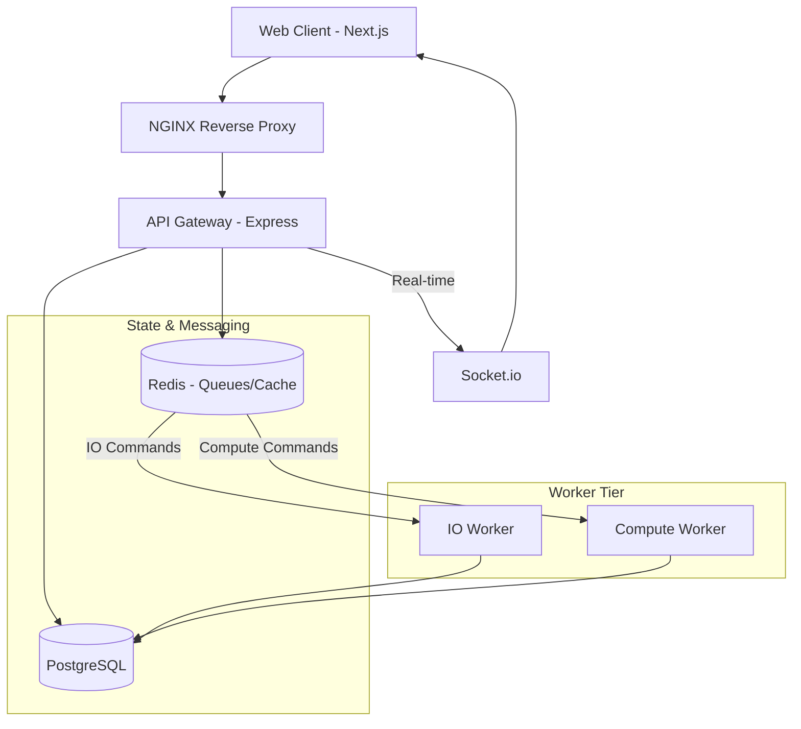

# Homelab System Design

Homelab is a high-performance, LAN-first personal cloud platform engineered with a focus on **distributed systems patterns**, **asynchronous processing**, and **security-first resource management**.

This document provides a deep dive into the architectural decisions, data flows, and engineering trade-offs that drive the platform.

---

## 1. High-Level Architecture

Homelab employs a **modular monolith** backend (Express.js) that orchestrates work across a distributed infrastructure. Heavy computational and I/O tasks are decoupled from the request-response cycle through dedicated background workers and Redis-backed command queues.


```mermaid
graph TD
    Client[Web Client - Next.js] --> Nginx[NGINX Reverse Proxy]
    Nginx --> API[API Gateway - Express]

    subgraph "State & Messaging"
        DB[(PostgreSQL)]
        Redis[(Redis - Queues/Cache)]
    end

    API --> DB
    API --> Redis

    subgraph "Worker Tier"
        IO[IO Worker]
        Compute[Compute Worker]
    end

    Redis -- IO Commands --> IO
    Redis -- Compute Commands --> Compute

    IO --> DB
    Compute --> DB

    API -- Real-time --> Sockets[Socket.io]
    Sockets --> Client
```


---

## 2. Core Pillars & Implementation

### A. Authentication & Session Management

Homelab implements a robust **JWT-based authentication** system with advanced security features:

- **Dual-Token Strategy:** Short-lived Access Tokens (JWT) + Long-lived Refresh Tokens (Database-backed).
- **Refresh Token Rotation:** Every refresh cycle issues a new token pair, invalidating the old refresh token.
- **Token Families & Reuse Detection:** All refresh tokens in a session belong to a family. If a revoked token is reused (indicating a potential breach), the entire family is immediately invalidated.
- **Race Condition Resilience:** A 30-second grace period is implemented for rotated tokens to handle concurrent network requests without forcing a logout.
- **TFA/OTP:** Multi-factor authentication via email for sensitive operations such as login and password resets.

---

### B. Storage Engine: Content-Addressable Storage (CAS)

Unlike naive storage systems, Homelab uses **Content-Addressable Storage (CAS)** principles to maximize efficiency and data integrity.

#### Blob Deduplication

Files are split into chunks and each chunk is hashed.

Identical content across different files references the same underlying blob, eliminating redundant storage.

#### Reference Counting

Each blob maintains a `refCount` used for safe garbage collection and lifecycle management.

#### Chunked Upload Pipeline

1. Client creates an `UploadSession`.
2. Chunks are uploaded concurrently.
3. Server validates chunk integrity through hash verification.
4. Chunks are associated with deduplicated blobs.
5. File metadata is finalized and persisted.

#### Bitmask Permission System

Homelab uses bitmask-based permissions for efficient access control.

Examples:

```text
READ
WRITE
DELETE
SHARE
ADMIN
```

This enables fast permission evaluation and inheritance throughout the virtual file system hierarchy.

---

### C. Distributed Rate Limiting

To prevent abuse and ensure quality of service, Homelab implements a **Distributed Token Bucket** algorithm.

#### Atomic Enforcement

Rate limiting logic executes inside Redis using Lua scripts, ensuring atomic updates across multiple API instances.

#### Multi-Level Scoping

Limits can be applied at various levels:

- Global
- Per-IP
- Per-User
- Per-Resource

#### Automatic Cleanup

Bucket state automatically expires based on refill characteristics, minimizing Redis memory usage.

---

### D. Asynchronous Task Processing

Heavy operations are offloaded from the request-response cycle to dedicated workers.

This keeps API latency low while enabling resource-intensive workloads to execute independently.

#### Queue Architecture

Homelab uses a command-oriented queue architecture built on Redis Streams.

Two queues exist:

```text
IO Queue
Compute Queue
```

The API explicitly schedules background work by publishing commands to the appropriate queue.

Example:

```text
File Uploaded
    ↓
API
    ↓
GENERATE_THUMBNAIL
```

This design was chosen over a generalized event bus because it provides:

- Simpler operational model
- Easier debugging
- Clear ownership of background work
- Lower infrastructure complexity
- Better alignment with current deployment constraints

The architecture intentionally favors maintainability over architectural abstraction.

---

#### IO Worker

Responsible for storage-oriented operations.

Examples:

- Folder zipping
- Bulk file copies
- Storage maintenance tasks

Characteristics:

- Disk-intensive
- Long-running
- Lower CPU utilization

---

#### Compute Worker

Responsible for media processing and computational workloads.

Examples:

- Thumbnail generation
- Future AI-powered workflows

Characteristics:

- CPU-intensive
- Memory-intensive
- Often delegates heavy work to external tools such as Sharp, FFmpeg, or AI inference services

Internally, the worker contains specialized handlers for each workload while remaining a single deployable service. This provides separation of concerns without introducing additional deployment complexity.

---

#### Worker Isolation

Workers execute as independent processes or containers.

Current deployment topology:

```text
API Server
IO Worker
Compute Worker
```

Additional worker types will only be introduced when resource contention or scaling requirements justify the operational cost.

---

## 3. Data Schema & Integrity

Homelab uses PostgreSQL with Prisma ORM for structured metadata management.


| Model                   | Purpose                                                     |
| ----------------------- | ----------------------------------------------------------- |
| **User**                | Identity, role management, quotas, authentication state     |
| **Folder/File**         | Virtual file system hierarchy with optimized lookup indexes |
| **Blob/FileChunk**      | Foundation of the deduplicated CAS engine                   |
| **UserShare/LinkShare** | Resource sharing and access control                         |
| **UploadSession**       | Tracks chunked upload lifecycle                             |
| **Job**                 | Background task tracking, progress reporting, and retries   |


---

## 4. Real-Time Infrastructure

Homelab leverages Socket.io for bidirectional communication.

### Broadcast System

Instant updates for:

- Chat
- Notifications
- System announcements

### Background Job Updates

Real-time progress and completion events are pushed directly to connected clients.

Examples:

- Upload completion
- Thumbnail generation completion
- Long-running file operations

### Presence (Planned)

Future support for collaborative awareness and active-user tracking within shared resources.

---

## 5. Engineering Trade-Offs

### Local Filesystem vs Object Storage

**Decision**

Local filesystem storage with an abstraction layer.

**Rationale**

- Optimized for LAN-first deployments
- Minimal infrastructure requirements
- Better self-hosting experience

**Future Path**

The `StoragePlatform` abstraction allows migration to:

- Amazon S3
- MinIO
- Cloudflare R2
- Other object storage providers

without affecting application logic.

---

### Redis vs Kafka

**Decision**

Redis Streams and Redis-backed queues.

**Rationale**

- Lower operational complexity
- Excellent fit for self-hosted environments
- Sufficient throughput for current workloads
- Simpler deployment and maintenance

**Future Path**

A dedicated event bus or Kafka-based architecture may be introduced if future requirements justify the complexity.

---

### Worker Consolidation vs Service Per Workload

**Decision**

Maintain two worker services:

```text
IO Worker
Compute Worker
```

instead of:

```text
Thumbnail Service
Embedding Service
Transcode Service
Metadata Service
```

**Rationale**

- Reduced operational complexity
- Lower memory footprint
- Better fit for constrained hardware
- Easier local deployment

Workloads remain logically separated through dedicated handlers while sharing deployment infrastructure.

---

## 6. Security Posture

### Credential Security

- Argon2/Bcrypt password hashing
- Refresh token rotation
- Token family invalidation
- Reuse detection

### Data Isolation

Strict tenant isolation is enforced through service-layer authorization and database-level access checks.

### Auditability

Major file operations and background jobs are tracked through:

- Job records
- Structured logs
- Administrative audit trails

### Least Privilege

All resources are private by default.

Permissions must be explicitly granted through sharing mechanisms.

---

## 7. Scalability Roadmap

### Phase 1 — Vertical Scaling

Increase worker concurrency and optimize storage throughput.

### Phase 2 — Horizontal API Scaling

Deploy multiple API instances behind NGINX.

Redis provides shared coordination and state.

### Phase 3 — Storage Decoupling

Migrate from local storage to distributed object storage for multi-node deployments.

### Phase 4 — Worker Specialization

Split Compute Worker workloads into dedicated services only when resource contention justifies additional operational complexity.

Potential future services:

```text
Thumbnail Worker
Embedding Worker
Transcode Worker
```

### Phase 5 — Event-Driven Architecture

Introduce a dedicated event bus only when multiple independently-scaled services require asynchronous coordination through shared domain events.

---

## Guiding Principle

Homelab prioritizes pragmatic engineering over architectural complexity.

Distributed systems patterns are adopted when they solve real operational problems, not simply because they are theoretically more scalable.

The architecture is intentionally designed to remain understandable, maintainable, and deployable on modest self-hosted hardware while preserving a clear path toward future scalability.